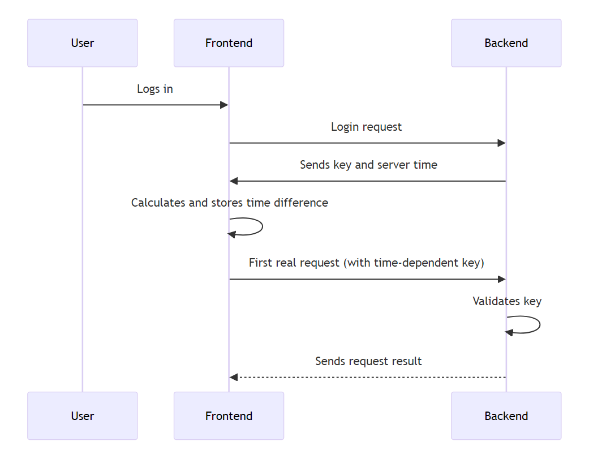

# Web-Based Authentication and Authorization Study
### Abstract
### This study explores various authentication and authorization methods employed in web-based software, highlighting their strengths and weaknesses. It proposes the development of a more secure system by dynamically adapting the login process to incorporate a time-based one-time password (TOTP) system, similar to those used by Steam Guard and Symantec. This approach enhances security by rendering captured network data obsolete for subsequent requests due to stringent time constraints.

